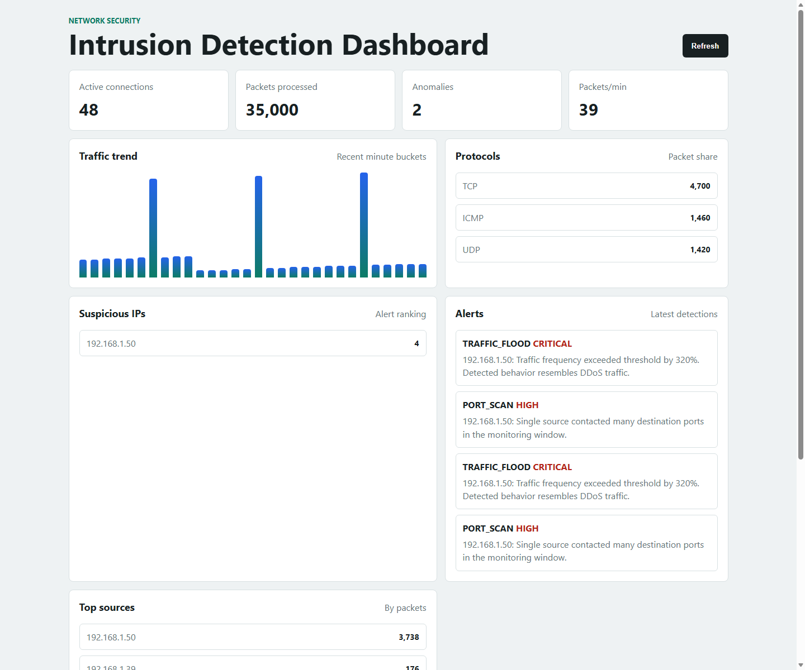
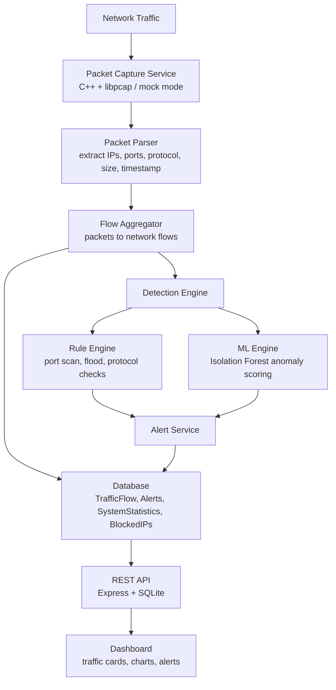
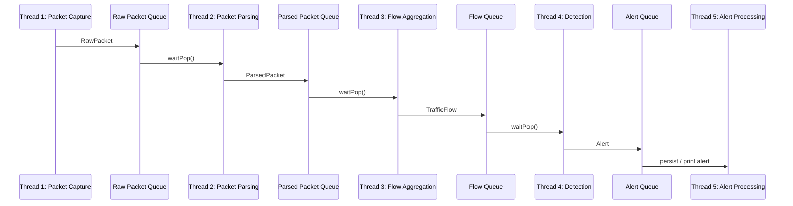

# Intelligent Network Intrusion Detection & Traffic Monitoring System

A real-time network security monitoring system that captures packet metadata, converts packets into flows, detects suspicious behavior, stores alerts, exposes REST APIs, and presents traffic activity through an administrator dashboard.

The project is designed as a student-friendly but realistic Network Intrusion Detection System (NIDS). It combines rule-based detection with an extensible machine learning path, starting with Isolation Forest for anomaly detection.



## Project Objective

The objective of this system is to continuously inspect network activity and identify suspicious traffic patterns such as port scanning, traffic flooding, brute-force style behavior, unusual protocol usage, and abnormal traffic spikes.

The system follows a layered architecture:

- capture packet metadata from network traffic
- parse and normalize packet fields
- aggregate raw packets into flow-level records
- apply rule-based detection
- prepare flow features for ML-based anomaly detection
- persist flows, statistics, blocked IPs, and alerts
- provide REST APIs for external clients
- display traffic insights in a dashboard

## Key Features

- **Packet capture layer** using C++ service structure and a Linux `libpcap` integration path.
- **Mock packet mode** for development and demos without administrator packet capture permissions.
- **Multithreaded backend pipeline** using `std::thread`, mutexes, condition variables, and thread-safe queues.
- **Flow aggregation** that converts packet events into connection-level network flows.
- **Rule-based detection** for port scans, traffic floods, and suspicious protocol behavior.
- **SQLite-backed REST API** for traffic statistics, alerts, suspicious IPs, and block actions.
- **Dashboard UI** showing active connections, packet counts, anomalies, protocol usage, trends, alerts, and top source IPs.
- **ML training starter** for Isolation Forest anomaly detection using flow-level features.
- **Docker deployment files** for API and dashboard services.

## Architecture



## Multithreaded Processing Pipeline

The C++ service is organized as five cooperating threads:



## Technology Stack

| Layer | Technology |
| --- | --- |
| Packet service | C++14, `std::thread`, mutex, condition variable |
| Packet capture | Mock capture mode, Linux `libpcap` path |
| API | Node.js, Express |
| Database | SQLite |
| Dashboard | HTML, CSS, JavaScript |
| ML starter | Python, pandas, scikit-learn, Isolation Forest |
| Deployment | Docker, Docker Compose |

## Project Structure

```text
network-intrusion-detection-system/
  backend/
    packet-capture/      Packet capture adapters
    parser/              Packet parsing helpers
    flow-engine/         Flow aggregation logic
    detection-engine/    Rule-based detection
    api/                 Express REST API
    common/              Shared models, queues, database helpers
  dashboard/             Administrator monitoring UI
  database/              SQLite schema
  docs/
    images/              README screenshots
    phase-1.md           Phase implementation notes
  ml/
    training/            Isolation Forest training script
    models/              Saved ML models
```

## Database Schema

The database contains four main tables:

- `TrafficFlow`: source/destination IPs, ports, protocol, packet count, bytes, duration, created time
- `Alerts`: alert type, severity, source IP, description, created time
- `SystemStatistics`: active connections, processed packets, anomaly count, CPU usage, timestamp
- `BlockedIPs`: IP addresses blocked through the API

## REST API Endpoints

| Method | Endpoint | Purpose |
| --- | --- | --- |
| `GET` | `/api/traffic/stats` | Get active connections, processed packets, and anomaly count |
| `GET` | `/api/alerts` | Get recent alerts |
| `GET` | `/api/suspicious` | Get suspicious IP addresses ranked by alert count |
| `GET` | `/api/traffic/protocols` | Get protocol distribution |
| `GET` | `/api/traffic/trends` | Get traffic trend buckets |
| `GET` | `/api/traffic/top-sources` | Get top source IPs by packet count |
| `POST` | `/api/block` | Add an IP address to the blocked IP list |

Example response from `/api/traffic/stats`:

```json
{
  "activeConnections": 48,
  "packetsProcessed": 35000,
  "anomalies": 2
}
```

## How To Run

### 1. Start the API

```powershell
cd backend/api
npm install
npm run seed
npm start
```

The API runs at:

```text
http://localhost:3000
```

Check:

```text
http://localhost:3000/api/traffic/stats
```

### 2. Start the Dashboard

Open a second terminal:

```powershell
cd dashboard
python -m http.server 5173
```

Open:

```text
http://127.0.0.1:5173/index.html
```

### 3. Test Blocking an IP

```powershell
Invoke-RestMethod -Method Post -Uri http://localhost:3000/api/block -ContentType "application/json" -Body '{"ip":"192.168.1.15"}'
```

Expected output:

```text
ip            status
--            ------
192.168.1.15  blocked
```

## Running the C++ Service

The C++ service includes a mock capture mode for development. On Linux or WSL:

```bash
sudo apt install cmake g++ libpcap-dev
cmake -S backend -B build
cmake --build build
./build/nids_service --mock
```

For real packet capture with libpcap:

```bash
cmake -S backend -B build -DENABLE_PCAP=ON
cmake --build build
sudo ./build/nids_service --interface eth0
```

Note: real packet capture usually requires Linux and administrator privileges. On Windows, WSL or a modern compiler toolchain is recommended.

## Machine Learning Component

The ML starter is located in:

```text
ml/training/train_isolation_forest.py
```

It prepares flow-level features such as:

- connection duration
- packets per second
- bytes per second
- protocol type
- connection count
- failed request count
- traffic frequency

The first model target is `IsolationForest`, which is practical for anomaly-based intrusion detection because it can identify unusual traffic patterns even when explicit attack labels are unavailable.

## Detection Logic

Current rule-based alerts include:

- **Port scan**: one source IP contacts many destination ports in a short monitoring window.
- **Traffic flood**: flow or source packet volume exceeds configured thresholds.
- **Suspicious protocol**: unexpected protocol appears in captured traffic.

The design allows future detection engines to add threat scores, anomaly probabilities, and explanations such as:

```text
Traffic frequency exceeded threshold by 320%.
Detected behavior resembles DDoS traffic.
Risk score: High.
```

## Docker

Build and run the API and dashboard:

```bash
docker compose up --build
```

Services:

- API: `http://localhost:3000`
- Dashboard: `http://localhost:8081`

## Testing Checklist

- Open `/api/traffic/stats` and confirm JSON response.
- Open `/api/alerts` and confirm alerts are returned.
- Open the dashboard and confirm cards and graphs load.
- Click dashboard refresh and confirm values stay visible.
- Call `POST /api/block` and confirm the IP is stored.
- Run `npm run seed` to add demo traffic and alert rows.

## Current Status

Implemented:

- Phase 1 backend architecture
- REST API
- SQLite schema
- dashboard UI
- seeded demo data
- C++ multithreaded processing scaffold
- Isolation Forest training starter
- Docker files

Planned improvements:

- direct C++ to SQLite ingestion
- live WebSocket dashboard updates
- completed libpcap packet field parsing
- ML prediction service integration
- auto IP blocking
- threat score generation
- chatbot-style alert explanation
